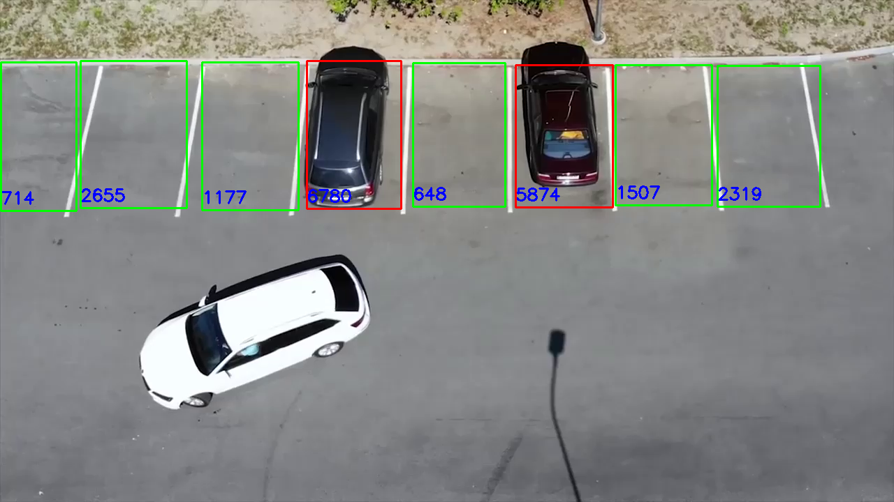

# Estacionamento Inteligente com Visão Computacional



Este projeto utiliza visão computacional com Python e OpenCV para analisar uma imagem da câmera de um estacionamento e determinar as vagas livres e ocupadas em tempo real. Ele oferece uma solução eficiente e inteligente para monitorar a disponibilidade de vagas em estacionamentos.

## Funcionalidades

- Detecção de carros estacionados.
- Classificação de vagas como "livres" ou "ocupadas".
- Interface de usuário simples para visualizar o status das vagas.
- Atualizações em tempo real da disponibilidade de vagas.

## Como Usar

1. Clone o repositório para sua máquina local:

   ```bash
   git clone https://github.com/Geraldo-Antonio/Estacionamento-VisaoComputacional.git
